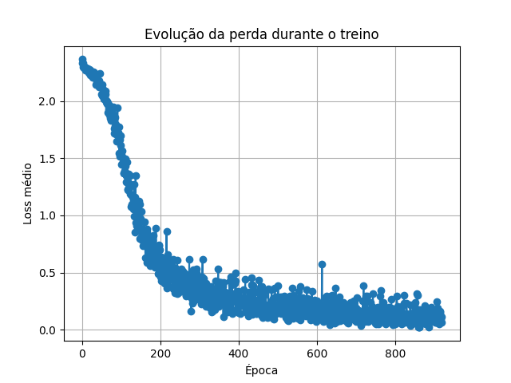

# Classificação de Dígitos com CNN em PyTorch

Este projeto implementa uma **Rede Neural Convolucional (CNN)** em PyTorch para classificar dígitos manuscritos do dataset `digits` do scikit-learn.

---

## Motivação
O objetivo é mostrar como **CNNs** são capazes de capturar padrões espaciais em imagens (bordas, curvas, texturas), superando perceptrons multicamadas simples, que tratam os pixels de forma independente.

---

##  Dataset
- **Fonte**: `load_digits` do scikit-learn.
- **Formato**: 1797 imagens em escala de cinza, tamanho 8×8 pixels.
- **Classes**: Dígitos de 0 a 9.

---

## Arquitetura da CNN
- **Conv2D**: 1 → 16 filtros (kernel 3×3) + ReLU  
- **MaxPooling2D**: janela 2×2  
- **Flatten**: vetoriza as features (16×3×3 = 144)  
- **Dense (fc1)**: 32 neurônios + ReLU  
- **Dense (fc2)**: 10 saídas (softmax implícito via CrossEntropyLoss)

---

## Treinamento
- **Otimizador**: Adam (lr=0.001)  
- **Função de perda**: CrossEntropyLoss  
- **Batch size**: 32  
- **Épocas**: 20 

---

## Resultados
- Acurácia em teste: ~97%  
- Evolução da perda durante o treino:  



---

## Possíveis melhorias
- Adicionar Dropout para reduzir overfitting.  
- Aumentar profundidade da CNN.  
- Usar dataset maior como MNIST.  

---

##  Como rodar
```bash
pip install -r requirements.txt

